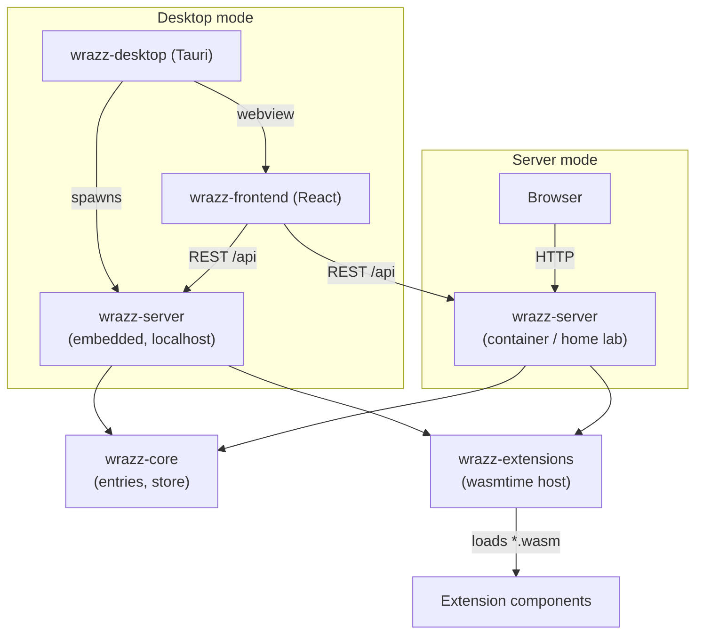
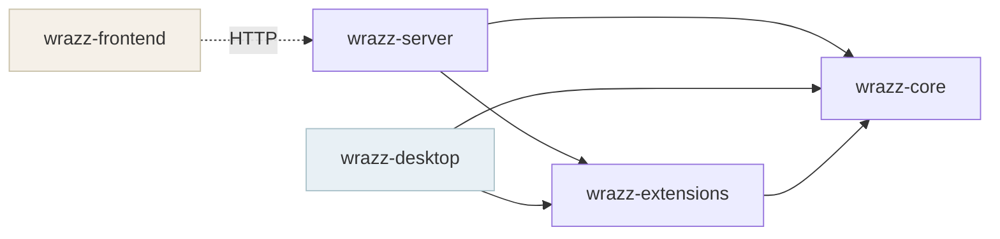
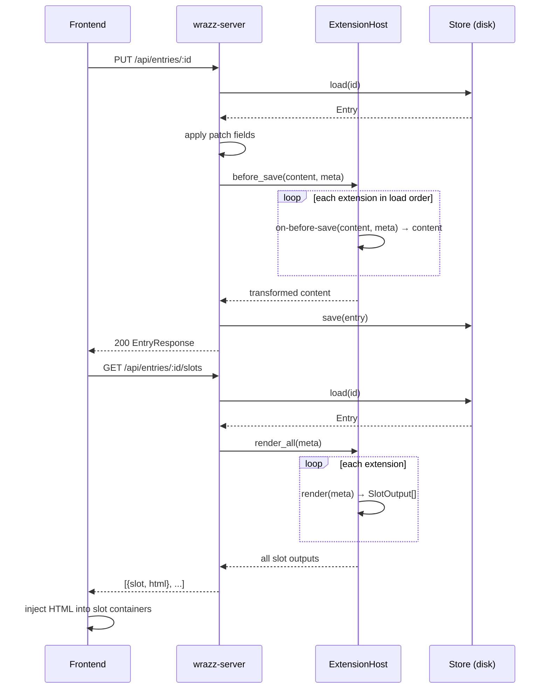
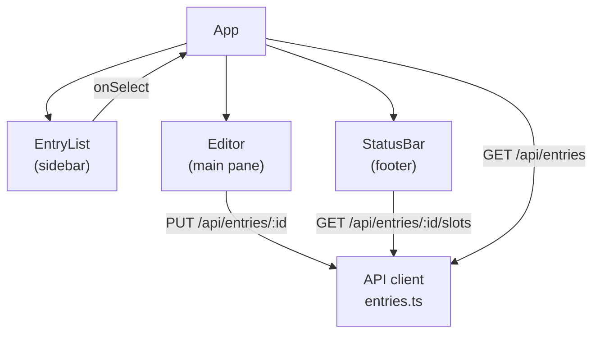

# wrazz — Design Document

wrazz is a self-hosted personal journal with a first-class extension framework.
This document describes every architectural decision in the project: what was chosen,
what was ruled out, and why. It is intended to be read before touching any code.

---

## System overview



---

## Goals

- **Source-mode editing.** Markdown is always visible as written. No hidden syntax,
  no WYSIWYG rendering in the editor pane. What you type is what is stored.
- **Paper feel.** The editor should feel like writing, not like a developer tool.
  Variable fonts, warm palette, generous leading.
- **Extensible by design.** Extensions are first-class, not an afterthought.
  The extension API is typed and sandboxed; the core app does not call arbitrary code.
- **Self-hostable and local-first.** The server runs on a home lab or a laptop with
  equal ease. No cloud dependency, no account required.
- **Open source (MIT).** Any fork is welcome.

---

## Deployment Modes

wrazz has two deployment modes that share identical frontend code.

### Server mode (web)

The Rust server (`wrazz-server`) runs as a container on a host or cluster. It serves:
- the compiled React frontend as static files (future: issue #4)
- the REST API at `/api`

A browser connects directly. There is no Electron or Tauri involved. This is the mode
used for the home lab deployment, where ArgoCD deploys the image from
`ghcr.io/gsfraley/wrazz`.

### Local mode (desktop)

Tauri wraps the React frontend in a native window. At startup, `wrazz-desktop` spawns
`wrazz-server` on a random localhost port and points the webview at it (future: issue #3).
The result is a self-contained desktop app with no network dependency.

In both modes the frontend talks to the server over HTTP. The Tauri layer is a thin shell
that handles the window and the local server lifecycle — it contains no business logic.

---

## Module Layout



```
wrazz/
├── Cargo.toml                        # Cargo workspace root
├── modules/
│   ├── wrazz-core/                   # Domain types and storage
│   ├── wrazz-server/                 # HTTP server (Axum)
│   ├── wrazz-extensions/             # Extension host (wasmtime)
│   ├── wrazz-desktop/
│   │   └── src-tauri/                # Tauri desktop shell
│   └── wrazz-frontend/               # React/Vite frontend
├── wit/
│   └── world.wit                     # WIT interface definition (extension API)
└── extensions/
    └── word-count/                   # Lamppost extension (reference implementation)
```

The `modules/` directory is flat — Rust crates and the frontend live as siblings.
Tauri's `tauri.conf.json` references `../wrazz-frontend` directly for `frontendDist`
and `devUrl`, making the build relationship explicit without tooling indirection.

---

## wrazz-core

**Purpose:** domain types and filesystem storage. All other modules depend on this;
it depends on nothing in the workspace.

### Entry model

```rust
pub struct Entry {
    pub id: String,          // filename stem — never stored inside the file
    pub title: String,
    pub content: String,
    pub tags: Vec<String>,
    pub created_at: DateTime<Utc>,
    pub updated_at: DateTime<Utc>, // always filesystem mtime — never stored inside the file
}
```

### Entry IDs

The entry ID is the **filename stem** — the filename without the `.md` extension.

- A file named `morning-pages.md` has ID `morning-pages`.
- The API addresses entries by this ID: `GET /api/entries/morning-pages`.
- wrazz generates IDs by slugifying the title on creation: "Evening Thoughts" → `evening-thoughts`.
  If that stem is taken, it appends `-2`, `-3`, etc.

This was chosen over UUID or hash-based IDs for one reason: a human can predict,
read, and type the ID. There is no collision risk because two files cannot share
a name in the same directory.

### Storage format

Each entry is a single Markdown file. The format is intentionally minimal:

```markdown
---
title: "Morning Pages"
tags: ["journal"]
created_at: "2026-04-15T10:30:00Z"
---

Entry body in Markdown.
```

Only three fields appear in front matter: `title`, `tags` (omitted if empty),
and `created_at`. `id` is not stored (it is the filename). `updated_at` is not
stored (it is the filesystem mtime, updated automatically on every write).

### Naked file support

Files with no front matter at all are fully supported. A human can open a text
editor, write plain Markdown, save it into the data directory, and wrazz will
pick it up correctly:

```markdown
# Morning Pages

Just some thoughts I wrote in my editor.
No front matter, no app involvement.
```

For naked files:
- `title` is taken from the first `# Heading` line, or the filename stem if none.
- `created_at` and `updated_at` both fall back to the file's mtime.
- `tags` is empty.

The `Store` struct provides `create`, `save`, `load`, `list`, and `delete` over a
configured directory (`WRAZZ_DATA_DIR`, defaulting to `./data`).

---

## wrazz-server

**Purpose:** Axum HTTP server. Owns the API routes, runs the extension hook pipeline,
and (in future) serves the compiled frontend as static files.

### API surface

| Method | Path | Description |
|--------|------|-------------|
| GET | `/api/entries` | List all entries, sorted by `updated_at` desc |
| POST | `/api/entries` | Create entry |
| GET | `/api/entries/:id` | Get one entry |
| PUT | `/api/entries/:id` | Update entry (partial — only provided fields) |
| DELETE | `/api/entries/:id` | Delete entry |
| GET | `/api/entries/:id/slots` | Get extension UI slot outputs for this entry |

All request and response bodies are JSON. Timestamps are RFC 3339 strings.

### Request lifecycle



### Extension hook pipeline

On every write (create or update), the server calls `ExtensionHost::before_save`
before persisting. Each loaded extension gets to transform the content in sequence.
The final value of `content` is what is written to disk.

On `/api/entries/:id/slots`, the server calls `ExtensionHost::render_all`, which
asks each extension to contribute HTML fragments for named UI slots.

### Configuration (environment variables)

| Variable | Default | Description |
|---|---|---|
| `WRAZZ_DATA_DIR` | `./data` | Directory for entry Markdown files |
| `WRAZZ_EXTENSIONS_DIR` | `./extensions` | Directory of `.wasm` extension files |
| `WRAZZ_BIND` | `0.0.0.0:3000` | Address and port to listen on |

---

## wrazz-extensions

**Purpose:** loads WASM extension components and calls them through the WIT interface.

### Why WASM/WASI

Extensions run as WebAssembly components. This provides:
- **Sandboxing.** Extensions cannot access the filesystem, network, or process
  environment beyond what the host explicitly grants through WASI imports.
- **Language-agnostic.** Any language that compiles to `wasm32-wasip2` can write
  an extension. The WIT interface is the contract, not a Rust trait.
- **Safe dynamic loading.** No shared library, no `unsafe`, no linking hazard.

The runtime is [wasmtime](https://wasmtime.dev) with the Component Model enabled.

### WIT interface (`wit/world.wit`)

The extension API is defined in a single WIT world. This file is the authoritative
source of truth for what extensions can and cannot do.

```wit
package wrazz:extensions;

interface types {
    record entry-meta {
        id: string,
        title: string,
        created-at: u64,   // Unix timestamp (seconds)
        updated-at: u64,
        tags: list<string>,
    }
}

interface hooks {
    use types.{entry-meta};

    // Called before an entry is written to disk.
    // Return value replaces the content — use this for transforms.
    on-before-save: func(content: string, meta: entry-meta) -> string;

    // Called after an entry is written to disk.
    on-after-save: func(meta: entry-meta);

    // Called when the user opens an entry.
    on-entry-open: func(meta: entry-meta);
}

interface ui {
    use types.{entry-meta};

    record slot-output {
        slot: string,   // "sidebar" | "toolbar" | "status-bar"
        html: string,   // HTML fragment; host renders in sandboxed container
    }

    render: func(meta: entry-meta) -> list<slot-output>;
}

world extension {
    use types.{entry-meta};
    export hooks;
    export ui;
}
```

Extensions receive `entry-meta` (id, title, timestamps, tags) but not the full entry
content in `render` — content is only available in `hooks::on-before-save`. This is
intentional: UI rendering should be fast and stateless; content transforms are explicit.

### Extension loading

At startup, `ExtensionHost::load_from_dir` scans `WRAZZ_EXTENSIONS_DIR` for `*.wasm`
files and loads each as a Component. If one fails to load, the error is logged and
the rest continue — a bad extension cannot crash the host.

### Host bindings (current state)

The wasmtime `bindgen!` macro wiring is not yet complete (tracked in issue #2). The
`Extension::render` and `Extension::on_before_save` methods currently return passthrough
values. The scaffold, store, and Component loading infrastructure is in place.

---

## wrazz-desktop

**Purpose:** Tauri 2 desktop shell. A thin wrapper — it opens a window, handles the
app lifecycle, and in local mode will own the embedded server process.

`src-tauri/tauri.conf.json` references `../wrazz-frontend/dist` for the production
build and `http://localhost:1420` (the Vite dev server) for development. The
`beforeDevCommand` and `beforeBuildCommand` invoke the frontend build via Yarn.

The design intent for local mode: `wrazz-desktop` spawns `wrazz-server` on a random
OS-assigned port at startup, injects the URL into the webview, and shuts the server
down on exit. The frontend is unaware of whether it is running in a browser or Tauri —
it always talks HTTP to whatever URL it was given.

---

## wrazz-frontend

**Purpose:** React/Vite single-page application. Runs in a browser (server mode)
or a Tauri webview (desktop mode) without modification.

### Component tree



### Editor design intent

The `Editor` component currently contains a `<textarea>` stub (clearly marked with
a `TODO` comment). The intended implementation (issue #1) is a custom component with:
- Variable font support (weight/width axes for Markdown emphasis and headings)
- Serif body font on a warm paper-toned background
- No toolbar — keyboard-driven
- Source mode only: Markdown punctuation is always visible

CodeMirror is explicitly **not** used for the main editor. It is reserved for
configuration editors elsewhere in the app, where developer-tool ergonomics are
appropriate.

### API client (`src/api/entries.ts`)

All server communication is in one file. Functions map 1:1 to API endpoints.
The Vite dev server proxies `/api` to `localhost:3000`, so the frontend never
needs to know the server's address during development.

### Styling

CSS custom properties define the palette:

| Variable | Value | Use |
|---|---|---|
| `--paper` | `#faf8f3` | Background throughout |
| `--ink` | `#1a1a18` | Primary text |
| `--ink-muted` | `#6b6b63` | Secondary text, dates, status |
| `--border` | `#ddd9ce` | Dividers, sidebar tint |

The editor textarea uses `--font-editor` (Georgia / Times New Roman serif) at 1.0625rem
with 1.75 line height and generous horizontal padding, approximating the feel of writing
on a page.

---

## extensions/word-count (lamppost)

The word-count extension is the reference implementation. It is intentionally trivial
so that the WIT interface pattern is easy to read without domain noise.

It implements every exported function in the `extension` world:
- `on-before-save` — passthrough (returns content unchanged)
- `on-after-save` — no-op
- `on-entry-open` — no-op
- `render` — injects a `<span>` into the `status-bar` slot

The injected HTML uses a `data-wrazz-live="word-count"` attribute as a hook for
the host to wire up a live word count without round-tripping to the server on every
keystroke. The host owns how that attribute is actuated.

Build target: `wasm32-wasip2`. The extension uses `wit-bindgen` to generate Rust
bindings from `../../wit/world.wit`.

---

## What is not in this repo

**AI / Claude integration** is intentionally absent from `gsfraley/wrazz`. Any
extension that calls an external AI API will live in a separate public repository
(`gsfraley/wrazz-extensions`, not yet created). This keeps the core app free of
API keys, model-specific logic, and third-party service dependencies. The boundary
is enforced by the extension sandbox: even if an AI extension were somehow included
here, it could only reach the network if the host explicitly granted it that WASI
capability — which the current host does not.

**Authentication** is out of scope for v1. The server has no auth layer. For the
home lab deployment, access is controlled at the ingress (Authentik SSO via the
cluster-standard OIDC gateway), not inside the app.

---

## Open issues

| # | Title |
|---|-------|
| [#1](https://github.com/gsfraley/wrazz/issues/1) | Custom source-mode editor with paper-feel typography |
| [#2](https://github.com/gsfraley/wrazz/issues/2) | Wire up wasmtime bindgen for WIT extension interface |
| [#3](https://github.com/gsfraley/wrazz/issues/3) | Tauri local mode — embed wrazz-server on localhost at startup |
| [#4](https://github.com/gsfraley/wrazz/issues/4) | Web mode — serve frontend static files from wrazz-server |
| [#5](https://github.com/gsfraley/wrazz/issues/5) | CI — GitHub Actions build + push to ghcr.io |
