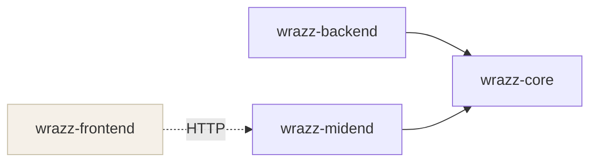
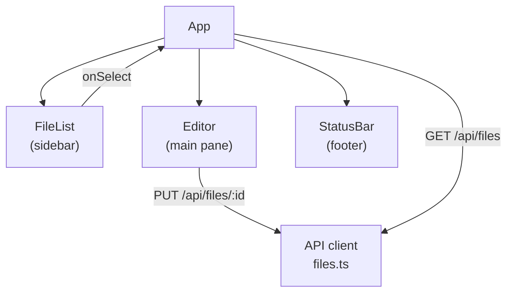

# wrazz — Design Document

wrazz is a self-hosted personal journal built around plain Markdown files.
This document describes every architectural decision in the project: what was chosen,
what was ruled out, and why. It is intended to be read before touching any code.

---

## Goals

- **Source-mode editing.** Markdown is always visible as written. No hidden syntax,
  no WYSIWYG rendering in the editor pane. What you type is what is stored.
- **Paper feel.** The editor should feel like writing, not like a developer tool.
  Variable fonts, warm palette, generous leading.
- **Extensible by design.** The architecture is shaped for extensions from day one,
  even before extension machinery exists. Hook points are named and reserved;
  filling them in later is adding an implementation, not a refactor.
- **Self-hostable and local-first.** Runs on a home lab or a laptop with equal ease.
  No cloud dependency, no account required.
- **Open source (MIT).** Any fork is welcome.

---

## Deployment Modes

wrazz has three deployment modes that share the same codebase and differ only
in which components are active and how they are wired together.

### All-in-one (desktop / local)

All three components run in a single binary. The midend talks to the backend via
direct function calls (no HTTP between them). This is the mode for a desktop app
running a local journal against a local directory.

```
wrazz-frontend (webview)
      ↓
wrazz-midend (in-process)
      ↓ direct calls
wrazz-backend (in-process)
      ↓
  filesystem
```

### Client + remote server

The frontend and midend run on the client machine; the backend runs on a server
somewhere. The midend talks to the backend over HTTP. The frontend is unaware of
the split — it always talks HTTP to the midend on localhost.

```
wrazz-frontend (browser / webview)
      ↓
wrazz-midend (client, HTTP out)
      ↓ HTTP
wrazz-backend (server)
      ↓
  filesystem
```

### Server-only (headless)

The backend runs alone. It exposes `/api/files/` directly. A browser connects
to the midend running on the same host, which forwards requests to the co-located
backend. This is the home-lab container deployment.

---

## Module Layout

```
wrazz/
├── Cargo.toml                    # Cargo workspace root
└── modules/
    ├── wrazz-core/               # Shared domain types (Entry, FileEntry, traits)
    ├── wrazz-backend/            # File storage and business logic (Axum)
    ├── wrazz-midend/             # Thin BFF proxy layer (Axum)
    └── wrazz-frontend/           # React/Vite single-page application
```

`wrazz-core` is the only module every other Rust crate depends on.
`wrazz-backend` and `wrazz-midend` are siblings — neither depends on the other.
`wrazz-frontend` is not a Rust crate; it is a Vite project that lives in `modules/`
alongside the Rust crates for layout clarity.

### Dependency graph



---

## wrazz-core

**Purpose:** shared domain types and the `Backend` trait. All Rust crates depend
on this; it depends on nothing in the workspace.

### FileEntry model

```rust
pub struct FileEntry {
    pub id: String,              // filename stem — never stored inside the file
    pub title: String,
    pub content: String,
    pub tags: Vec<String>,
    pub created_at: DateTime<Utc>,
    pub updated_at: DateTime<Utc>, // always filesystem mtime — never stored inside the file
}
```

### File IDs

The file ID is the **filename stem** — the filename without the `.md` extension.

- A file named `morning-pages.md` has ID `morning-pages`.
- The API addresses files by this ID: `GET /api/files/morning-pages`.
- wrazz generates IDs by slugifying the title on creation: "Evening Thoughts" → `evening-thoughts`.
  If that stem is taken, it appends `-2`, `-3`, etc.

Human-readable IDs were chosen over UUIDs or hashes for one reason: a human can
predict, read, and type the ID. There is no collision risk because two files cannot
share a name in the same directory.

### Storage format

Each file is a single Markdown file. The format is intentionally minimal:

```markdown
---
title: "Morning Pages"
tags: ["journal"]
created_at: "2026-04-15T10:30:00Z"
---

Entry body in Markdown.
```

Only three fields appear in front matter: `title`, `tags` (omitted if empty),
and `created_at`. `id` is not stored (it is the filename). `updated_at` is not
stored (it is the filesystem mtime, updated automatically on every write).

### Naked file support

Files with no front matter are fully supported. A human can open any text editor,
write plain Markdown, save it into the data directory, and wrazz picks it up:

```markdown
# Morning Pages

Just some thoughts I wrote in my editor.
```

For naked files:
- `title` is taken from the first `# Heading` line, or the filename stem if none.
- `created_at` and `updated_at` both fall back to the file's mtime.
- `tags` is empty.

### Backend trait

The `Backend` trait is the contract between `wrazz-midend` and whatever storage
implementation is running. Two implementations exist:

```rust
#[async_trait]
pub trait Backend: Send + Sync {
    async fn list_files(&self) -> Result<Vec<FileEntry>>;
    async fn get_file(&self, id: &str) -> Result<FileEntry>;
    async fn create_file(&self, title: String, content: String, tags: Vec<String>) -> Result<FileEntry>;
    async fn update_file(&self, id: &str, patch: FilePatch) -> Result<FileEntry>;
    async fn delete_file(&self, id: &str) -> Result<()>;
}
```

| Implementation | Used when | How it works |
|---|---|---|
| `LocalBackend` | All-in-one mode | Calls `wrazz-backend` directly in-process |
| `HttpBackend` | Client + remote server | Makes REST calls to a remote `wrazz-backend` |

The midend holds an `Arc<dyn Backend>` and never knows which implementation it got.
Deployment mode determines which is injected at startup.

---

## wrazz-backend

**Purpose:** file storage and business logic. Scans a configured directory,
reads and writes Markdown files, exposes a REST API.

### API surface

| Method | Path | Description |
|--------|------|-------------|
| GET | `/api/files` | List all files, sorted by `updated_at` desc |
| POST | `/api/files` | Create file |
| GET | `/api/files/:id` | Get one file |
| PUT | `/api/files/:id` | Update file (partial — only provided fields) |
| DELETE | `/api/files/:id` | Delete file |

All request and response bodies are JSON. Timestamps are RFC 3339 strings.

### Configuration

| Variable | Default | Description |
|---|---|---|
| `WRAZZ_DATA_DIR` | `./data` | Directory for Markdown files |
| `WRAZZ_BIND` | `127.0.0.1:3000` | Address and port to listen on |

### Hook points

The request lifecycle has named hook points reserved for a future extension system.
In v1 they are no-ops (the content passes through unchanged), but the code is
structured so that wiring in a real extension host later is an implementation change,
not an architectural change:

```
create / update:
  load → [before_save hook] → write → [after_save hook] → respond

open:
  load → [on_open hook] → respond
```

---

## wrazz-midend

**Purpose:** thin BFF (Backend For Frontend) proxy. Sits between the frontend and
the backend. Owns the frontend-facing API shape, handles any request translation,
and will own auth concerns when those are added.

In v1, the midend is purely a pass-through: it receives requests from the frontend
and forwards them to the `Backend` trait implementation. Its value is architectural —
it is the stable boundary that lets deployment mode change without the frontend
or backend knowing.

The midend's Axum handlers take `State<Arc<dyn Backend>>` and are identical
regardless of whether `LocalBackend` or `HttpBackend` is injected.

---

## wrazz-frontend

**Purpose:** React/Vite single-page application. Runs in a browser or a future
Tauri webview without modification. Always talks HTTP to the midend.

### Component tree



### Editor design intent

The `Editor` component contains a `<textarea>` stub in v1. The intended
implementation is a custom component with:
- Variable font support (weight/width axes for Markdown emphasis and headings)
- Serif body font on a warm paper-toned background
- No toolbar — keyboard-driven
- Source mode only: Markdown punctuation is always visible

CodeMirror is explicitly **not** used for the main editor. It is reserved for
configuration editors elsewhere in the app where developer-tool ergonomics fit.

### API client (`src/api/files.ts`)

All server communication is in one file. Functions map 1:1 to API endpoints.
The Vite dev server proxies `/api` to the midend, so the frontend never needs
to know the backend's address during development.

### Styling

CSS custom properties define the palette:

| Variable | Value | Use |
|---|---|---|
| `--paper` | `#faf8f3` | Background throughout |
| `--ink` | `#1a1a18` | Primary text |
| `--ink-muted` | `#6b6b63` | Secondary text, dates, status |
| `--border` | `#ddd9ce` | Dividers, sidebar tint |

---

## What is not in this repo

**Extension machinery** is intentionally deferred. The hook points are named and
the `Backend` trait boundary is clean, but no WASM runtime, WIT interface, or
extension loading exists yet. The reference extension (`word-count`) lives on the
`far-throw-initial-ai-generation` branch as a design artifact.

**AI / Claude integration** will live in a separate public repository
(`gsfraley/wrazz-extensions`, not yet created). The core app will remain free of
API keys and model-specific logic. The hook architecture ensures AI extensions
cannot reach outside what the host explicitly grants.

**Authentication** is out of scope for v1. For the home lab deployment, access is
controlled at the ingress (Authentik SSO), not inside the app.

**Tauri desktop shell** is deferred. The all-in-one binary described above will
eventually be wrapped in a Tauri window, but v1 is browser-only.

---

## Open issues

| # | Title |
|---|-------|
| [#1](https://github.com/gsfraley/wrazz/issues/1) | Custom source-mode editor with paper-feel typography |
| [#2](https://github.com/gsfraley/wrazz/issues/2) | Wire up extension hook points |
| [#3](https://github.com/gsfraley/wrazz/issues/3) | All-in-one binary — embed backend in desktop client |
| [#4](https://github.com/gsfraley/wrazz/issues/4) | Web mode — serve frontend static files from midend |
| [#5](https://github.com/gsfraley/wrazz/issues/5) | CI — GitHub Actions build + push to ghcr.io |
